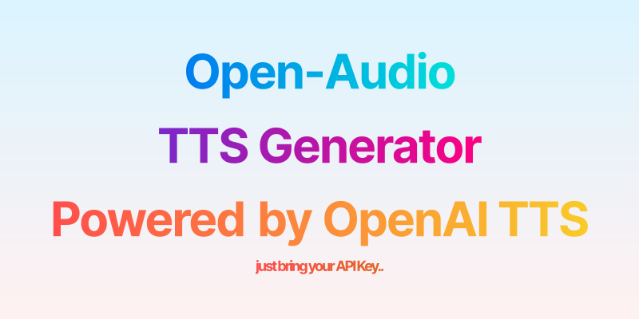
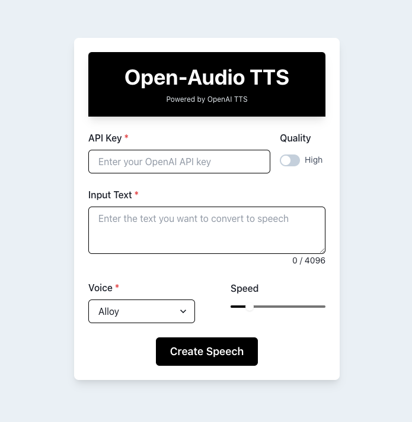

Check out the live website: [OpenAudio.ai](https://openaudio.ai)

# Open-Audio TTS

Open-Audio TTS is a web application that allows users to convert text into natural-sounding speech. Powered by OpenAI's text-to-speech models, this tool offers an intuitive user interface built with Chakra UI, providing a seamless experience for generating and downloading speech audio files.

## Features

- **Text-to-Speech**: Convert any text into speech with high-quality voices powered by OpenAI's TTS models.
- **Customizable Voices**: Choose from a variety of voices to find the one that best suits your needs.
- **Adjustable Speed**: Control the speed of the speech to match your preferred listening pace.
- **BYO**: Bring your Own (BYO) API keys, no data is stored on server side.
- **Downloadable Audio**: Easily download the generated speech as an MP3 file directly from the browser.
- **User-Friendly Interface**: Built with responsiveness in mind, offering a comfortable experience across different devices.

## Deploy on Vercel

The easiest way to deploy your Next.js app is to use the [Vercel Platform](https://vercel.com/new?utm_medium=default-template&filter=next.js&utm_source=create-next-app&utm_campaign=create-next-app-readme) from the creators of Next.js.

## Installation

To set up the project locally, follow these steps:

1. Clone the repository to your local machine.
2. Navigate to the project directory.
3. Install dependencies with `npm install`.
4. Start the development server with `npm run dev`.
5. Open `http://localhost:3000` to view it in the browser.

## How to use Environment Variable (Disabled and reverted to keep things purely on Client Side)
1. Copy the `.env.example` file to:
    - .env.local file: For Local Development (This should not be committed to Git) - `cp .env.example .env.local`
    - .env: For Production Deployment (This can be via Vercel Environment Variables under your Project's settings page. `cp .env.example .env`
2. Add your OPENAI_API_KEY by creating or copying your OpenAI API key under the [API keys](https://platform.openai.com/api-keys) section on OpenAI's website.
3. Save, restart your app and run `npm run dev`. Your API key will now be set from the Environment Variables instead of the UI and UI element will be disabled.

## Usage

To use Open-Audio TTS, simply:

1. Enter your OpenAI API key in the provided field.
2. Type or paste the text you wish to convert into the 'Input Text' field.
3. Select the voice and adjust the speed as desired.
4. Click on 'Create Speech' to generate the audio.
5. Once the audio is generated, use the controls to play it or click 'Download MP3' to save it.

# Demo

## Contributing

Contributions are welcome! If you have a suggestion or an issue, please use the [issues](#) page to let me know.

## License

This project is licensed under the MIT License - see the [LICENSE](LICENSE.md) file for details.

## Acknowledgments

- Thanks to OpenAI for providing the text-to-speech API.
- Chakra UI for the beautiful component library.
- <a target="_blank" href="https://icons8.com/icon/PgPOu9C2G4Dq/speech-to-text">Speech To Text</a> icon by <a target="_blank" href="https://icons8.com">Icons8</a>

## Deploy on Vercel

The easiest way to deploy your Next.js app is to use the [Vercel Platform](https://vercel.com/new?utm_medium=default-template&filter=next.js&utm_source=create-next-app&utm_campaign=create-next-app-readme) from the creators of Next.js.

Check out our [Next.js deployment documentation](https://nextjs.org/docs/deployment) for more details.
